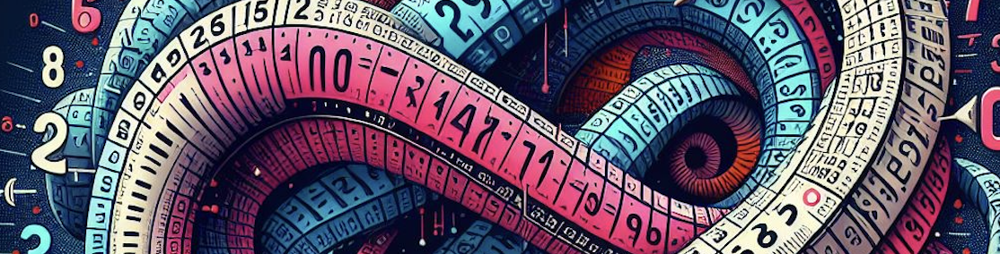

# CoNatural Numbers

## Infinite Binary Sequences

Given a type $A$, a **sequence** $a$ in $A$ is a function $a \colon \mathbb{N} \to A$. That is, it assigns to every natural number $n : \mathbb{N}$ a term $a(n)$ in $A$. 

Consider the type of sequences $\mathbb{N} \to 2$, where $2$ is the type with two terms, $0$ and $1$. The type $\mathbb{N} \to 2$ is also known as the type of **infinite binary sequences**. A term of this type is a function that assigns to every natural number $n$ a term in $2$. We can imagine this as an infinite list of $0$'s and $1$'s. An example of such a sequence is the function $a \colon \mathbb{N} \to 2$ defined by $a(n) = n \mod 2$, which can be represented as the infinite list $0, 1, 0, 1, 0, 1, \ldots$. Another example is the constant function $b \colon \mathbb{N} \to 2$ defined by $b(n) = 0$, which can be represented as the infinite list $0, 0, 0, 0, 0, 0, \ldots$. Or, the constant function $c \colon \mathbb{N} \to 2$ defined by $c(n) = 1$, which can be represented as the infinite list $1, 1, 1, 1, 1, 1, \ldots$. 

Given a binary sequence $a \colon \mathbb{N} \to 2$, the **$n$-th position** (or **$n$-th index**) of $a$ is defined by to be $a(n)$. Therefore, the $0$-th position of the sequence $a$ is $a(0)$, the $1$-st position of the sequence $a$ is $a(1)$, and so on. We sometime informally write the sequence $a$ as

$$ a = a_0 \, a_1 \, a_2 \, a_3 \, a_4 \, a_5 \, \ldots $$

**Exercise** 
How many binary sequences are there?

For every natural number, we associate a binary sequence in two different ways: First, given $n : \mathbb{N}$, we can associate the binary sequence the sequence $i(n) : \mathbb{N} \to 2$ which has at the $n$-th position a $1$ and $0$'s everywhere else.  For example, the natural number $0$ is associated with the binary sequence $0, 0, 0, 0, 0, 0, \ldots$, the natural number $1$ is associated with the binary sequence $0, 1, 0, 0, 0, 0, 0, \ldots$, the natural number $2$ is associated with the binary sequence $0, 1, 0, 0, 0, 0, \ldots$, and so on.

$$
0 \mapsto 0, 0, 0, 0, 0, 0, \ldots \\
1 \mapsto 0, 1, 0, 0, 0, 0, \ldots \\
2 \mapsto 0, 0, 1, 0, 0, 0, \ldots \\ 
\vdots
$$

**Exercise** 
Describe the function $i(n)$ more precisely using a mathematical expression. 

In the second assignment, we associate to $n : \mathbb{N}$ the binary sequence $d(n) : \mathbb{N} \to 2$ consisting of $n$ copies of $1$ followed by $0$s. More precisely, $d(n)$ is defined by $d(n)(m) = 1$ if $m <> n$ and $d(n)(m) = 0$ if $m \geq n$.

$$
0 \mapsto 0, 0, 0, 0, 0, 0, \ldots \\
1 \mapsto 1, 0, 0, 0, 0, 0, \ldots \\
2 \mapsto 1, 1, 0, 0, 0, 0, \ldots \\
\vdots
$$

We say that a binary sequence $a \colon \mathbb{N} \to 2$ is **eventually constant** if there exists a natural number $n$ such that for all $m \geq n$, we have $a(m) = a(n)$.

We say that a binary sequence $a \colon \mathbb{N} \to 2$ is **decreasing** if for all $n : \mathbb{N}$, we have $a(n + 1) \le a (n)$. 

**Exercise**
Show that every decreasing binary sequence is eventually constant.

**Exercise**
Show that a binary sequence $a \colon \mathbb{N} \to 2$ is decreasing if and only if 
$$ \forall i : \mathbb{N} , \big( \exists j : \mathbb{N} ,  (j\leq i \land x_j =0 ) \implies x_i=0 \big) $$

We define the type of **co-natural numbers**, denoted by $\mathbb{N}_\infty$, to be the type of decreasing binary sequences.

**Exercise**
Show that the sequence $d(n)$ is a co-natural number for every natural number $n$, but that the sequence $i(n)$ is not a co-natural number for any natural number $n$.

**Exercise**
Define a function $f \colon \mathbb{N}_\infty \to 1 \oplus \mathbb{N}$ where $1$ is unit type, i.e. the type with only one term, and $\oplus$ is the disjoint sum type.

**Exercise**
How many co-natural numbers are there?